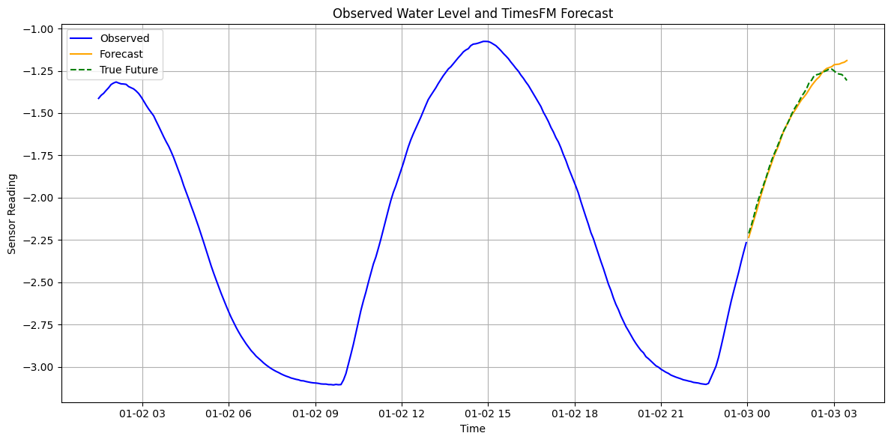

# SecooraRiskModel
This research project involves an end-to-end Machine Learning system that integrates IoT-based environmental sensing, time-series machine learning, and real estate economics to quantify the pricing impact of flood risk on housing in Tybee Island, Georgia.

In the first phase, we built a streaming data pipeline from a custom IoT water-level sensor deployed in Tybee Island, capturing real-time hydrological data. This data feeds into a time-series ML model designed to estimate a robust monthly flood-risk index.

In the second phase, we use this index and apply a hedonic regression model to housing prices in flood-prone neighborhoods where home insurance pricing is expected to reflect actual risk. These fitted models are then extended to other regions to detect systemic underpricing or overpricing in the housing market based on environmental exposure. The goal is to produce a geographic distribution of mispricing, enabling climate-aware valuation and more informed investment or policy decisions.

## Project Structure

```
SecooraRiskModel/
│
├── airflow/
│   ├── dags/
│   │   └── pipeline.py
│   ├── Dockerfile
│   └── requirements.txt
│
├── model/
│   ├── train_model.py
│   └── model.pkl
│
├── data/                   
│   ├── predictions.csv
│   └── historical.csv
│   └── plot.png
│
├── data_utils/                   
│   └── DataLoader.py
│
├── frontend/
│   ├── app.py
│   └── Dockerfile
│
└── docker-compose.yml

```



## Pricing Approach 

The complete model is used to generate a flood-risk-index which can be used as a regression-variable in the following log-linear hedonic pricing approach to gain an understanding of systematic mispricing from unfactored flood-risk.

$\log(\text{Price}_i) = \beta_0 + \beta_1 \cdot \text{FloodRisk}_i + \beta_2 \cdot \text{Acres}_i + \beta_3 \cdot \text{YearBuilt}_i + \beta_4 \cdot \text{Commercial}_i + \dots + \varepsilon_i$

$\text{Mispricing}_i = \text{ActualPrice}_i - \widehat{\text{Price}}_i$
